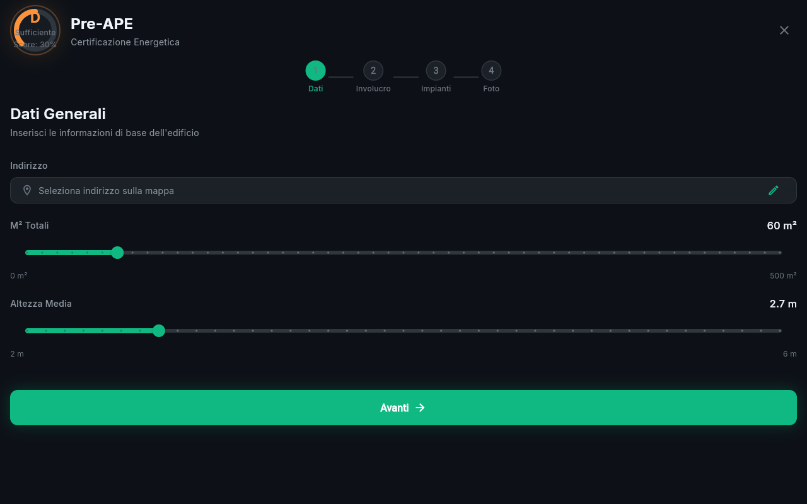
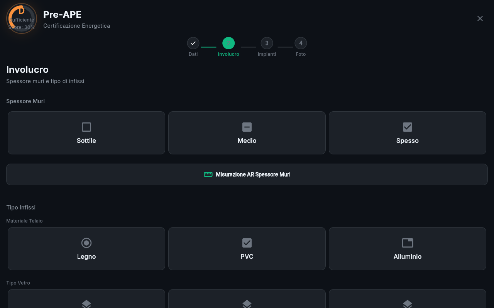
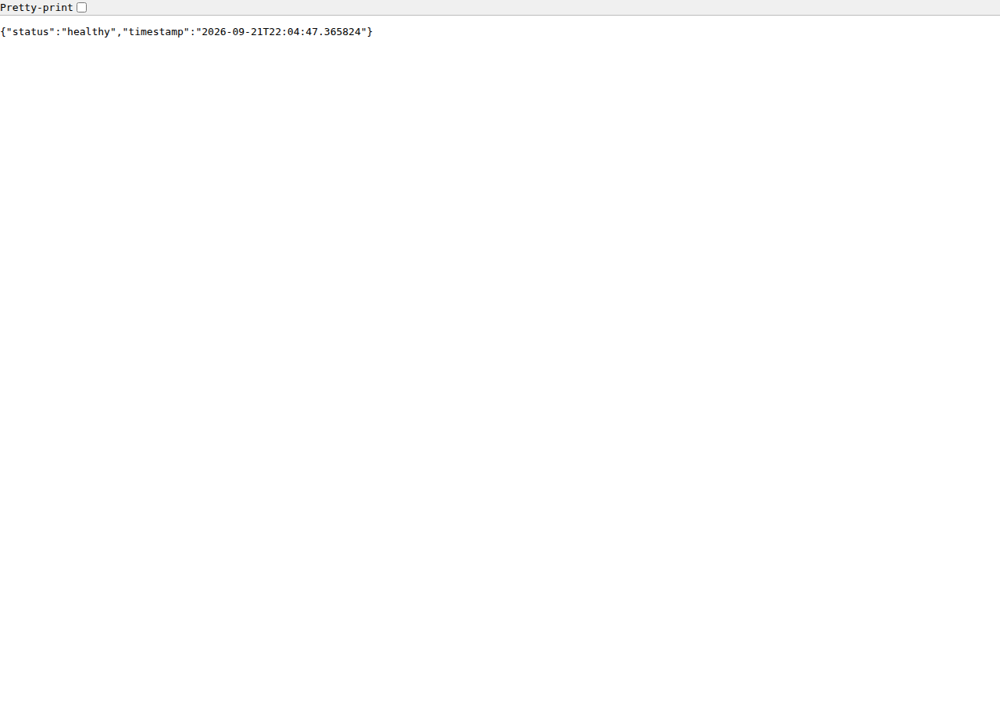

# Pre-APE — Assistente digitale per la Certificazione Energetica

App Flutter (web + Android + iOS) + backend FastAPI che sostituisce i rilievi cartacei con un flusso guidato e potenziato dall'IA.





---

## Architettura

| Componente | Tech | Host (fase 1) |
|------------|------|---------------|
| Frontend | Flutter 3.44 · Dart 3.12 · Riverpod | Docker / Vercel (gratis) |
| API | FastAPI · Uvicorn | Docker (porta **7031**) |
| DB | PostgreSQL 15 | Docker container `pre_ape_postgres` (porta **5433**) |
| Auth | Google OAuth 2.0 | Free |
| Storage | Google Drive (utente) | Free |
| Geocoding | OpenStreetMap + Nominatim | Free |

```
Flutter Web ──HTTPS──▶ FastAPI :7031 ──▶ PostgreSQL :5433
                           │
                   ┌───────┼───────┐
                   ▼       ▼       ▼
              Google   Nominatim  Ollama
              Drive     (OSM)   (AI Vision)
```

---

## Quick start

### Backend

```bash
cd backend
pip install -e ".[dev]"
python main.py          # http://localhost:7031
```

### Frontend (Docker — consigliato)

```bash
cd frontend
docker run --rm -v preape-pubcache:/pubcache \
  -v $(pwd):/project -w /project \
  ghcr.io/cirruslabs/flutter:stable \
  sh -c "flutter pub get && flutter build web --release --base-href /pre-ape/"

# Apri http://localhost:7032/pre-ape/
python3 -m http.server 7032 -d build/web
```

### Tests

```bash
# Backend
cd backend && python -m pytest tests/ -v

# Frontend (Docker)
docker run --rm -v preape-pubcache:/pubcache \
  -v $(pwd):/project -w /project \
  ghcr.io/cirruslabs/flutter:stable flutter analyze
```

---

## Funzionalità

- ✅ **Wizard 4 step** — Dati Generali → Involucro → Impianti → Foto
- ✅ **Geolocalizzazione GPS** — posizione reale via browser, reverse geocoding Nominatim
- ✅ **Importa punto OSM** — seleziona su OpenStreetMap, incolla coordinate
- ✅ **Altezza default 2.7 m** (max slider 4 m, inserimento manuale per valori maggiori)
- ✅ **Superficie default 60 m²**
- ✅ **Tachimetro energetico** — gauge animato A4→G con calcolo score real-time
- ✅ **Backend REST** — CRUD surveys + photo analyses + results endpoint
- ✅ **Database PostgreSQL** — schema users / surveys / photo_analyses
- 🔜 Google OAuth + Drive (prossimo sprint)
- 🔜 AI Vision per foto caldaie (Ollama/OpenAI/Anthropic)
- 🔜 WhatsApp bot (fase futura)

---

## Struttura

```
pre_ape/
├── AGENTS.md              # Istruzioni per agenti AI
├── REQUIREMENTS.md        # Requisiti V-cycle (tracciabili)
├── SAAS_PLAN.md           # Piano SaaS / hosting / monetizzazione
├── backend/
│   ├── main.py            # Entry point (porta 7031)
│   ├── app/
│   │   ├── api/v1/        # Router + schemas + endpoints
│   │   ├── core/config.py # Config (env / .env)
│   │   ├── models/        # SQLAlchemy models
│   │   └── services/      # AI Vision (non collegato)
│   └── tests/
└── frontend/
    ├── lib/
    │   ├── main.dart              # Entry + ProviderScope
    │   ├── core/                  # Theme, router, constants
    │   └── features/onboarding/   # Wizard 4 step + provider
    ├── assets/fonts/Inter.ttf
    └── pubspec.yaml
```

---

## APE — Campi legali (Italia)

Il wizard è allineato ai requisiti del **D.Lgs. 192/2005** e **D.M. 26/06/2015**.
Vedi `REQUIREMENTS.md` §8 per l'elenco completo dei campi obbligatori.

---

## Hosting consigliato

| Fase | Costo | Stack |
|------|-------|-------|
| Sviluppo / pilot | **€0** | Docker sul server domestico |
| Primo cliente | **~€5-15/mo** | Vercel (frontend) + Railway (backend) + Supabase (DB) |
| Scala (100+ utenti) | **~€30-60/mo** | Railway Pro + Neon Scale + Stripe |

---

## License

Proprietario — non distribuire senza autorizzazione.
